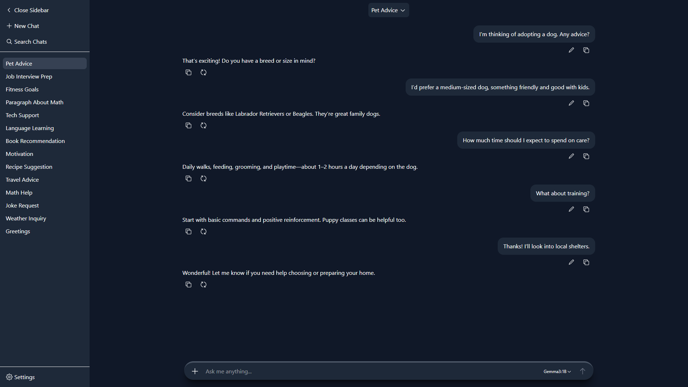

# 🤖 Chatbot Web App

A full-stack AI-powered personal assistant web app built with Django, React, Docker, and modern UI/UX patterns.

[Portfolio](https://gabrielschieber.github.io)

<picture>
  <source media="(prefers-color-scheme: dark)" srcset="docs/screenshots/index_dark.png">
  <source media="(prefers-color-scheme: light)" srcset="docs/screenshots/index_light.png">
  
</picture>

## Overview

This project explores how to build a responsive, production-ready chatbot interface that handles
dynamic layouts, streaming responses, and real-world UI edge cases such as resizing sidebars,
mobile dialogs, and growing input composers.

## Features

- 💬 Real-time chat interface with message streaming
- 📐 Responsive layout with collapsible sidebar and mobile dialog mode
- 🧠 Context-aware conversation handling
- ✍️ Auto-expanding message composer with smooth animations
- 🌙 Dark mode with system preference detection
- 🌍 Internationalized UI and form validation messages
- 🚢 Containerized development and deployment

## Tech Stack

**Backend**
- Django, Channels (WebSockets) and Django REST Framework
- Custom model validation and querysets for improved robustness
- HTTP-only JWT-based authentication with email, password and optional TOTP 2FA.
- Ollama as the AI engine providing message generation

**Frontend**
- Vite with React and TypeScript
- Radix UI, Tailwind CSS and Framer Motion for accessible, stylized and animated components
- CSS Flexbox for adaptive layouts
- Light and dark modes with automatic system preference recognition

**Deployment**
- Daphne as the server
- Nginx as the proxy and static files provider
- Docker and Docker Compose for containerized and reproducible deployments

**Other**
- Responsive design with mobile-first considerations
- Robust architecture with type-safe APIs
- Both the backend and frontend are thoroughly tested using Python's unittest, pytest and Playwright

### Why this stack?
I chose Django for its strong validation guarantees and React for its flexibility
in handling complex, animated UI states such as dynamic chat layouts.

## Architecture

The app is split into a clear backend/frontend boundary:

- The backend handles conversation logic, validation, and persistence
- The frontend manages UI state, layout, and animations
- Chat messages are streamed incrementally to improve perceived performance

## Usage

Information about how to develop and publish the app is available in [docs/usage.md](docs/usage.md).

## Future Improvements

- AI model memory for storing user preferences
- Chat summarization for increased perceived context window
- Canvas editor for writing and coding
- Pluggable AI providers